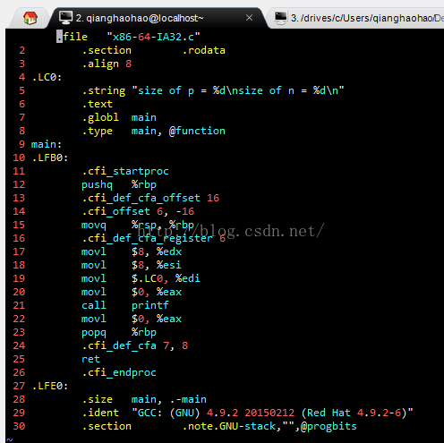

#<center>i386平台和x86_64平台机器代码的区别</center>

#说明:
                                在此i386(IA32)指的是Intel32位处理器上硬件和GCC代码的组合.
                                x86_64指代在AMD和Intel的较新的64位处理器上运行的硬件和GCC代码的组合.


# x86-64代码与i386机器生成的代码有极大的不同.主要内容如下:
1.指针和长整型数是64位长.整数算术运算支持8,16,32，和64位数据类型.
2.通用寄存器组从8个扩展到16个.
3.许多程序状态都保存在寄存器中，而不是在栈上.整型和指针类型的过程参数(最多6个)通过寄存器传递.有些过程根本不需要访问栈.
4.如果可能，条件操作用条件传送指令实现，会得到比传统分支代码更好的性能.
5.浮点数作用面向寄存器的指令集来实现，而不用IA32支持的基于栈的方法来实现


为了验证以上区别，在x86-64 Linux平台用不同的GCC编译选项来生成不同平台的C代码对应的汇编代码:
测试如下代码:

```cpp
//文件名:x86-64-IA32.c
   #include<stdio.h>
   int main()
   {
       int *p;  //int型指针变量
       long n;  //定义长整型变量
       printf("size of p = %d\nsize of n = %d\n", sizeof(p), sizeof(n));
       return 0;
   }
```
# 一.I386
先在i386 Linux上运行命令:gcc -S  -m32 x86-64-IA32.c 产生IA32机器兼容的汇编代码:


当把以上代码编译成可执行代码是输出结果为：
> size of p = 4
> size of  n = 4 

#二. x86-64
在x86-64 Linux上运行命令:gcc -S -m64 x86-64-IA32.c 产生x86-64平台的汇编代码:


当把以上代码编译成可执行代码是输出结果为：

> size of p = 8
> size of  n = 8

      
#总结:
从以上结果对比可以看出i386平台和x86-64平台的代码有很大的区别，

在i386平台指针类型和long类型大小都为4，在x64平台指针类型和long类型大小都为8.另外两者产生的汇编代码也不同

在x64平台指令后缀为q，如pushq ，popq等，而在i386位movl，pushl等.至于其他更多的区别可以写其他测试代码来检验，在此不做过多的介绍.


